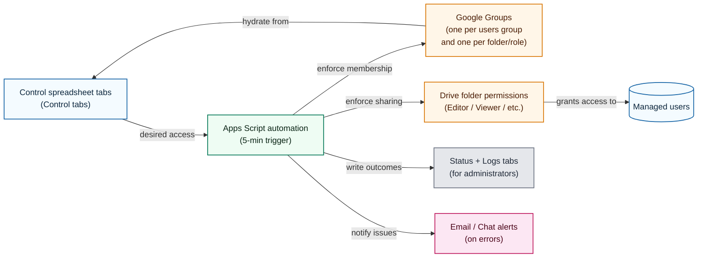

# Google Drive Permission Manager

> **Important Note:** This project requires a **Google Workspace domain**. While personal @gmail.com accounts can be managed by this system, they cannot be used by administrators to directly run the Apps Script due to its reliance on Google Workspace administrative APIs.

The Google Drive Permission Manager offers a convenient, spreadsheet-based solution for organizations seeking centralized control over data sharing. It empowers people that are not professional administrators to be"sheet_editors" and manage complex access permissions for Google Drive folders directly from a Google Sheet. The sheet serves as the single source of truth. Hence, it is particularly well-suited for environments where teams and projects are dynamic, and traditional identity management systems may not be feasible.

This project supports accessibility for organizations at a low cost: Any user with a Google-affiliated account (including free @gmail.com addresses) can be granted access, while the management of these permissions can be delegated to a list of trusted users who also do not need to be paid Google Workspace administrators. It requires only a registered domain (~$10/year) and a single Google Workspace user license (starting from ~$8/month) to operate.

The system has Apps Scripts that synchronizes the permissions defined in the control sheet with Google Workspace. This synchronization can be triggered manually by a super admin (paid) user at any time or configured to run automatically at regular intervals. To manage permissions efficiently and at scale, the script creates and maintains Google Groups for each folder and role combination, ensuring a robust and maintainable access control structure. This repository provides the complete scripts, an AI setup assistant, accompanied by comprehensive setup guides, and automated tests to enable a smooth and consistent rollout.

---

## Table of contents

1. [Key features](#key-features)
2. [Example use cases](#example-use-cases)
3. [Setup](#setup)
4. [System life cycle](#system-life-cycle)
5. [Architecture overview](#architecture-overview)
6. [Conceptual comparison: Google Drive vs. SharePoint](#conceptual-comparison-google-drive-vs-sharepoint)
7. [First-time Google Workspace setup](#first-time-google-workspace-setup)
8. [Manual setup with clasp](#manual-setup-with-clasp)
9. [Daily usage](#daily-usage)
10. [Cost transparency](#cost-transparency)
11. [Security & privacy](#security--privacy)
12. [Automation & production deployment](#automation--production-deployment)
13. [Documentation map](#documentation-map)
14. [Testing](#testing)
15. [Tearing down the project](#tearing-down-the-project)
16. [Community](#community)

---

## Key features

- **Spreadsheet-first workflow** – Manage Drive access using a Google Spreadsheet that
  team members can edit.
- **Google Group indirection** – Each folder/role combination receives its own
  Google Group so Drive never hits the per-folder sharing limit.
- **Safety-first syncs** – Separate menu items for "Sync Adds", "Sync Deletes",
  and "Full Sync" help administrators preview destructive operations.
- **Comprehensive logging** – Operational logs, test logs, and optional email
  notifications make auditing straightforward.
- **Extensive test helpers** – Built-in stress tests and manual access tests are
  available directly from the spreadsheet UI.
- **AI setup assistant** – Guides you through the setup process in a pre-configured cloud environment, simplifying deployment.

---

## Example use cases

This tool is most effective for managing access for ad-hoc teams and projects that exist outside of an organization's primary, automated systems (like an HR database or a student enrollment system).

- **Community Group/Volunteer Organization** – A local community group or volunteer organization collaborates on various initiatives. They use shared Google Drive folders for documents, event planning, and communication. Members primarily use their personal free @gmail.com accounts. An organizer needs to quickly add or remove volunteers from specific project folders without requiring a full Google Workspace administrator role or paid accounts for all members. The spreadsheet-based system allows for easy management by designated "sheet editors" who can update access for volunteers using their personal Gmail addresses.
- **University Research Lab** – A lab includes professors, post-docs, and a rotating group of graduate students and visiting scholars. They need tiered access to shared folders for raw data (PIs only), analysis scripts (lab members), and manuscript drafts (lab members + external collaborators). These groups are not formal university "classes," making them ideal for spreadsheet-based management.
- **Consulting Firm** – 50 active client projects that each require separate Editor and Viewer groups to isolate deliverables from engagement records. As consultants join or leave a project team, an administrator can quickly update the relevant spreadsheet tab to grant or revoke access in minutes.

---

## Setup

We offer two ways to set up the Google Drive Permission Manager:

### Custom GPT Assistant

For the fastest setup experience, use the Custom GPT: https://chatgpt.com/g/g-694f76da8b348191a1c7c497663106d2-custom-gpt-prompt-gdrive-permissions1. It is intuitive, supports pasting screenshots to debug issues, and provides step-by-step guidance, but it can only suggest actions and cannot run `gcloud` or other commands for you.

**Technicalities** - The Custom GPT relies on a backend to stay current and reliable; see [Backend for GPT artifacts and steps](docs/BACKEND_SERVER.md) and [Backend considerations](docs/BACKEND_CONSIDERATIONS.md).[^gpt-backend]

### AI-Assisted Setup (Commands + Guidance)

If you want an assistant that can run commands instead of only suggesting them, use the AI-powered assistant. It runs in a pre-configured cloud environment (GitHub Codespaces) and will guide you through every step of the process.

To launch the assistant, you will need a GitHub account.

[](https://codespaces.new/davidf9999/gdrive_permissions1?ref=main)

### Manual Setup

If you prefer to set up the project manually, we have a comprehensive, step-by-step guide that covers every required action.

**➡️ See the full [Setup Guide](docs/SETUP_GUIDE.md) to get started.**

---

[^gpt-backend]: Advanced users can host the GPT backend (`backend/server.js`) to control access, caching, and artifact freshness.

## System life cycle

To plan the project from first install through retirement, see the [System life cycle](docs/SYSTEM_LIFE_CYCLE.md) guide. It outlines the setup, day-to-day usage, and teardown stages and links to the detailed documentation for each phase.

---

## Understanding the Roles

This system involves a few key user roles, from the Super Admin who performs the initial setup to the Sheet Editors who manage permissions day-to-day. Before you begin, it's helpful to understand who does what.

**➡️ See our [Roles and Responsibilities Guide](docs/ROLES_AND_RESPONSIBILITIES.md) for a full breakdown.**

---

## Architecture overview

At a glance, the system combines three moving pieces:

1. **Control spreadsheet** – Administrators describe folders, roles, and Google Group
   membership using purpose-built tabs.
2. **Apps Script automation** – A bound script reads those tabs every five
   minutes (or on-demand) and reconciles Workspace to match the plan.
3. **Google Workspace services** – Drive folders and Google Groups are updated
   via the Admin SDK and Drive APIs, with results surfaced back to the spreadsheet via
   status tabs and optional alerting.



For a detailed architectural narrative—including how the control spreadsheet is
structured, how folder roles fan out to groups and individuals, how the sync
loop runs, and which personas operate each part—see
[`docs/ARCHITECTURE_OVERVIEW.md`](docs/ARCHITECTURE_OVERVIEW.md).

That document also includes important **[Performance & Scaling
Considerations](docs/ARCHITECTURE_OVERVIEW.md#performance--scaling-considerations)**,
which explains the expected limits of the Apps Script platform and suggests
alternatives for enterprise-scale deployments.

## Conceptual comparison: Google Drive vs. SharePoint

SharePoint is a helpful analogy for readers coming from Microsoft ecosystems, but it is not a supported backend for this tool. For the full explanation—including a feature-by-feature comparison table—see [`docs/SHAREPOINT_COMPARISON.md`](docs/SHAREPOINT_COMPARISON.md), which is also linked from the [FAQ](FAQ.md#can-sharepoint-replace-google-drive-for-this-project).

---

## Daily usage

1. Refresh the spreadsheet and open **Permissions Manager** from the menu bar.
2. Run **Full Sync (Add & Delete)** for the first execution so all folders,
   groups, and tabs are provisioned.
3. Populate the generated user tabs with email addresses. Removing an email (or
   marking it disabled) followed by **Sync Deletes** revokes access.
4. Review the `Log` sheet after each sync for status messages. Errors contain
   actionable guidance.

For advanced workflows (AutoSync scheduling, edit mode safeguards, or the
risk-based auto sync), consult the guides in the `docs/` directory.

---

## Updating the Script

If the underlying Apps Script code is updated (for example, after pulling new changes from this repository), you will need to re-deploy the script to your spreadsheet.

The process is simple:

1.  **Use the latest bundle:** The repository includes a prebuilt bundle at `dist/apps_scripts_bundle.gs`. You can copy it directly without running any commands.

    If you prefer to build locally, run:
    ```bash
    node create_apps_scripts_bundle.js
    ```

2.  **Copy the bundle:** Open `dist/apps_scripts_bundle.gs` and copy its entire contents.

3.  **Update Apps Script:**
    -   Open your control spreadsheet.
    -   Go to **Extensions → Apps Script**.
    -   In the Apps Script editor, you should see a file named `Code.gs` (or similar).
    -   Delete all the existing code in that file and paste the new code you copied from `dist/apps_scripts_bundle.gs`.
    -   Click the **Save project** icon.

Your spreadsheet is now running the latest version of the script.

---

## Cost transparency

- **Google Workspace**: typically **$6–18/user/month** depending on your plan
  ([pricing details](https://workspace.google.com/pricing.html)).
- **Google Cloud APIs**: Admin SDK and Drive API usage for this tool generally
  stays within the free tier; costs scale with very large deployments. Use the
  [Google Cloud pricing calculator](https://cloud.google.com/products/calculator)
  if you expect high volumes.
- **Domain registration**: varies by provider (commonly **~$20/year**).

Most small to medium deployments remain within free quotas; billing is still
required to unlock Admin SDK limits.

---

## Security & privacy

- **Permissions requested**: the script uses Admin SDK scopes to manage Google
  Groups and Drive scopes to share folders on your behalf.
- **Data location**: all managed data (folder metadata, group membership, and
  logs) stays inside your Google Spreadsheet and Workspace tenant; nothing is
  sent to external services.
- **Access to your data**: neither the script authors nor contributors can see
  your spreadsheet contents because everything runs within your domain.
- **Compliance**: administrators should review organisational requirements (e.g.
  GDPR or FERPA) and ensure only authorised users have edit access to the control
  spreadsheet and Apps Script project.

---

## Automation & production deployment

Infrastructure helpers are currently **archived** from `main` to keep the
deployment path simple and avoid shipping untested automation. The remaining
recommendation is to use `ProductionOptimizations.gs` (optional helpers that
reduce API calls during large syncs).

---

## Documentation map

| Topic | Location |
| ----- | -------- |
| AI assistant setup & development | [`docs/AI_ASSISTANT_GUIDE.md`](docs/AI_ASSISTANT_GUIDE.md) |
| Custom GPT setup guide | [`docs/GPT_SETUP_GUIDE.md`](docs/GPT_SETUP_GUIDE.md) |
| End-user how-to guide | [`docs/USER_GUIDE.md`](docs/USER_GUIDE.md) |
| Testing menus and stress scenarios | [`docs/TESTING.md`](docs/TESTING.md) |
| Edit-only mode walkthrough | [`docs/EDIT_MODE_GUIDE.md`](docs/EDIT_MODE_GUIDE.md) |
| Auto-sync options & safety levers | [`docs/AUTO_SYNC_GUIDE.md`](docs/AUTO_SYNC_GUIDE.md) & [`docs/RISK_BASED_AUTO_SYNC.md`](docs/RISK_BASED_AUTO_SYNC.md) |
| Stopping or pausing scripts | [`docs/STOP_SCRIPTS.md`](docs/STOP_SCRIPTS.md) |
| Full setup walkthrough (Workspace, Cloud, Script) | [`docs/SETUP_GUIDE.md`](docs/SETUP_GUIDE.md) |
| Spreadsheet and script onboarding checklist | [`docs/ONBOARDING.md`](docs/ONBOARDING.md) |
| SharePoint conceptual comparison | [`docs/SHAREPOINT_COMPARISON.md`](docs/SHAREPOINT_COMPARISON.md) |
| Frequently asked questions | [`FAQ.md`](FAQ.md) |
| Architecture deep dive | [`docs/ARCHITECTURE_OVERVIEW.md`](docs/ARCHITECTURE_OVERVIEW.md) |
| Historical decisions & debugging notes | [`GEMINI.md`](GEMINI.md) |
| Release history | [`CHANGELOG.md`](CHANGELOG.md) |

---

## Testing

Automated Jest tests validate the merge utilities and supporting JavaScript:

```bash
npm ci
npm test -- --runInBand
```

The Apps Script logic is validated through the in-spreadsheet testing harness. After
pushing updates, open the spreadsheet and run **Permissions Manager → Testing →
Run All Tests**. See [`docs/TESTING.md`](docs/TESTING.md) for details and
troubleshooting.

---

## Tearing down the project

To remove the automation:

1. In the spreadsheet, run **Sync Deletes** to revoke any remaining folder
   access.
2. Delete the Google Groups that were created for managed folders.
3. Remove the Apps Script project or delete the bound spreadsheet entirely.
4. If you used the Terraform or Docker workflows, destroy the provisioned Google
   Cloud resources using the respective tooling.

---

## Community

- Review the [Contributing guide](CONTRIBUTING.md) before opening a pull
  request.
- Follow the [Code of Conduct](CODE_OF_CONDUCT.md) to keep the community
  welcoming.
- File issues using the templates under `.github/ISSUE_TEMPLATE/` so we can
  triage efficiently.

Thank you for helping us build a safer way to manage Google Drive permissions!
