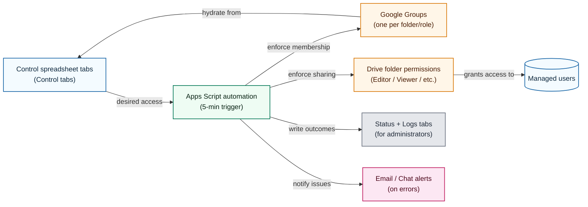

# Google Drive Permission Manager

> **Important Note:** This project requires a **Google Workspace domain**. While personal @gmail.com accounts can be managed by this system, they cannot be used by administrators to directly run the Apps Script due to its reliance on Google Workspace administrative APIs.

The Google Drive Permission Manager automates Drive folder sharing by treating
one Google Spreadsheet as the source of truth for access. Each folder/role combination
gets its own tab where administrators list email addresses—no scripting
experience required. A bound Apps Script project runs on a five-minute cadence
to keep the relevant Google Groups and Drive permissions aligned with those
tabs. This repository packages that script alongside guided setup
documentation, automated tests, and optional infrastructure helpers so teams can
roll out the workflow consistently.

---

## Table of contents

1. [Key features](#key-features)
2. [Example use cases](#example-use-cases)
3. [✋ Stop! Do you have these requirements?](#-stop-do-you-have-these-requirements)
4. [Architecture overview](#architecture-overview)
5. [First-time Google Workspace setup](#first-time-google-workspace-setup)
6. [Manual setup with clasp](#manual-setup-with-clasp)
7. [Daily usage](#daily-usage)
8. [Cost transparency](#cost-transparency)
9. [Security & privacy](#security--privacy)
10. [Automation & production deployment](#automation--production-deployment)
11. [Documentation map](#documentation-map)
12. [Testing](#testing)
13. [Tearing down the project](#tearing-down-the-project)
14. [Community](#community)

---

## Key features

- **Spreadsheet-first workflow** – Manage Drive access using a Google Spreadsheet that
  team members can edit.
- **Google Group indirection** – Each folder/role combination receives its own
  Google Group so Drive never hits the per-folder sharing limit.
- **Safety-first syncs** – Separate menu items for "Sync Adds", "Sync Deletes",
  and "Full Sync" help administrators preview destructive operations.
- **Comprehensive logging** – Operational logs, test logs, and optional email
  notifications make auditing straightforward.
- **Extensive test helpers** – Built-in stress tests and manual access tests are
  available directly from the spreadsheet UI.

---

## Example use cases

- **Educational institution** – 500 students across 20 courses where each
  course has shared folders for instructors, teaching assistants, and students.
- **Consulting firm** – 50 active client projects that each require separate
  Editor and Viewer groups to isolate deliverables and engagement records.

---

## ✋ Stop! Prerequisites

This tool has a few requirements to get started:

- [ ] **Google Workspace:** You need a Google Workspace subscription for your organization. The script is not compatible with personal `@gmail.com` accounts.
- [ ] **Super Admin Access:** You must have a user account with Super Admin privileges for your Google Workspace tenant (i.e., your organization's entire Google environment). This is required for the initial setup.
- [ ] **Domain Name:** You need a registered domain name that you own and have connected to your Google Workspace account.
- [ ] **Billing Account:** A Google Cloud billing account is needed. For most use cases, the free tier will be sufficient.

If you are missing any of these, please review the [`docs/WORKSPACE_SETUP.md`](docs/WORKSPACE_SETUP.md) guide for detailed instructions on how to set them up.

---

## Architecture overview

At a glance, the system combines three moving pieces:

1. **Control spreadsheet** – Administrators describe folders, roles, and Google Group
   membership using purpose-built tabs.
2. **Apps Script automation** – A bound script reads those tabs every five
   minutes (or on-demand) and reconciles Workspace to match the plan.
3. **Google Workspace services** – Drive folders and Google Groups are updated
   via the Admin SDK and Drive APIs, with results surfaced back to the spreadsheet via
   status tabs and optional alerting.



For a detailed architectural narrative—including how the control spreadsheet is
structured, how folder roles fan out to groups and individuals, how the sync
loop runs, and which personas operate each part—see
[`docs/ARCHITECTURE_OVERVIEW.md`](docs/ARCHITECTURE_OVERVIEW.md).

That document also includes important **[Performance & Scaling
Considerations](docs/ARCHITECTURE_OVERVIEW.md#performance--scaling-considerations)**,
which explains the expected limits of the Apps Script platform and suggests
alternatives for enterprise-scale deployments.

---

## First-time Google Workspace setup

If you are starting from a brand-new Google Workspace tenant, or need a step-by-step guide to configure the script within your existing Workspace, follow the comprehensive guide in [`docs/WORKSPACE_SETUP.md`](docs/WORKSPACE_SETUP.md). It walks through:

1. Creating (or reusing) a Workspace tenant and initial Super Admin account.
2. Turning on Google Groups for Business and confirming Super Admin privileges.
3. Creating the control spreadsheet and binding an Apps Script project.
4. Installing this repository with [`clasp`](https://github.com/google/clasp).
5. Enabling the Admin SDK and Drive APIs, granting OAuth consent, and running the
   first sync.

Keep that guide open alongside this README when onboarding new administrators—it
captures every click needed for the initial deployment.

---

## Manual setup with clasp

The canonical deployment flow uses [`clasp`](https://github.com/google/clasp) to
push the multi-file Apps Script project to your spreadsheet.

### 1. Install tooling

- Install Node.js 18+ and npm.
- Install clasp globally:
  ```bash
  npm install -g @google/clasp
  ```

### 2. Create the control spreadsheet

1. Create a new Google Spreadsheet named something descriptive (e.g., `Drive
   Permissions Control`).
2. Open **Extensions → Apps Script** to create the bound script project.
3. Copy the **Script ID** from **Project Settings → IDs** — you need it shortly.

### 3. Configure clasp locally

1. Log into clasp:
   ```bash
   clasp login
   ```
2. At the repository root, create `.clasp.json` pointing at the bound project:
   ```json
   {
     "scriptId": "YOUR_SCRIPT_ID",
     "rootDir": "apps_script_project"
   }
   ```
3. Pull the remote manifest so the local project matches the Apps Script
   project:
   ```bash
   clasp pull
   ```

### 4. Push the source files

Deploy all `.gs` and `.js` files to Apps Script:

```bash
clasp push
```

Refreshing the spreadsheet should now reveal a **Permissions Manager** menu.

### 5. Enable required APIs and consent screen

1. In the Apps Script editor, open **Services** and add the following advanced
   services:
   - `AdminDirectory`
   - `Drive` (API v3)
2. From **Project Settings**, follow the link to the attached Google Cloud
   project and ensure the **Admin SDK API** and **Google Drive API** are both
   enabled.
3. Configure the OAuth consent screen if prompted:
   - User type: **Internal** (recommended for Workspace domains)
   - Populate the required contact details and add yourself as a test user.

With APIs enabled, you can return to the spreadsheet and run the initial sync.

---

## Daily usage

1. Refresh the spreadsheet and open **Permissions Manager** from the menu bar.
2. Run **Full Sync (Add & Delete)** for the first execution so all folders,
   groups, and tabs are provisioned.
3. Populate the generated user tabs with email addresses. Removing an email (or
   marking it disabled) followed by **Sync Deletes** revokes access.
4. Review the `Log` sheet after each sync for status messages. Errors contain
   actionable guidance.

For advanced workflows (AutoSync scheduling, edit mode safeguards, or the
risk-based auto sync), consult the guides in the `docs/` directory.

---

## Cost transparency

- **Google Workspace**: typically **$6–18/user/month** depending on your plan
  ([pricing details](https://workspace.google.com/pricing.html)).
- **Google Cloud APIs**: Admin SDK and Drive API usage for this tool generally
  stays within the free tier; costs scale with very large deployments. Use the
  [Google Cloud pricing calculator](https://cloud.google.com/products/calculator)
  if you expect high volumes.
- **Domain registration**: varies by provider (commonly **~$20/year**).

Most small to medium deployments remain within free quotas; billing is still
required to unlock Admin SDK limits.

---

## Security & privacy

- **Permissions requested**: the script uses Admin SDK scopes to manage Google
  Groups and Drive scopes to share folders on your behalf.
- **Data location**: all managed data (folder metadata, group membership, and
  logs) stays inside your Google Spreadsheet and Workspace tenant; nothing is
  sent to external services.
- **Access to your data**: neither the script authors nor contributors can see
  your spreadsheet contents because everything runs within your domain.
- **Compliance**: administrators should review organisational requirements (e.g.
  GDPR or FERPA) and ensure only authorised users have edit access to the control
  spreadsheet and Apps Script project.

---

## Automation & production deployment

Infrastructure helpers are currently **archived** from `main` to keep the
deployment path simple and avoid shipping untested automation. The remaining
recommendation is to use `ProductionOptimizations.gs` (optional helpers that
reduce API calls during large syncs).

---

## Documentation map

| Topic | Location |
| ----- | -------- |
| End-user how-to guide | [`docs/USER_GUIDE.md`](docs/USER_GUIDE.md) |
| Testing menus and stress scenarios | [`docs/TESTING.md`](docs/TESTING.md) |
| Edit-only mode walkthrough | [`docs/EDIT_MODE_GUIDE.md`](docs/EDIT_MODE_GUIDE.md) |
| Auto-sync options & safety levers | [`docs/AUTO_SYNC_GUIDE.md`](docs/AUTO_SYNC_GUIDE.md) & [`docs/RISK_BASED_AUTO_SYNC.md`](docs/RISK_BASED_AUTO_SYNC.md) |
| Stopping or pausing scripts | [`docs/STOP_SCRIPTS.md`](docs/STOP_SCRIPTS.md) |
| Workspace + script installation walkthrough | [`docs/WORKSPACE_SETUP.md`](docs/WORKSPACE_SETUP.md) |
| Spreadsheet and script onboarding checklist | [`docs/ONBOARDING.md`](docs/ONBOARDING.md) |
| Frequently asked questions | [`FAQ.md`](FAQ.md) |
| Architecture deep dive | [`docs/ARCHITECTURE_OVERVIEW.md`](docs/ARCHITECTURE_OVERVIEW.md) |
| Historical decisions & debugging notes | [`GEMINI.md`](GEMINI.md) |
| Release history | [`CHANGELOG.md`](CHANGELOG.md) |

---

## Testing

Automated Jest tests validate the merge utilities and supporting JavaScript:

```bash
npm ci
npm test -- --runInBand
```

The Apps Script logic is validated through the in-spreadsheet testing harness. After
pushing updates, open the spreadsheet and run **Permissions Manager → Testing →
Run All Tests**. See [`docs/TESTING.md`](docs/TESTING.md) for details and
troubleshooting.

---

## Tearing down the project

To remove the automation:

1. In the spreadsheet, run **Sync Deletes** to revoke any remaining folder
   access.
2. Delete the Google Groups that were created for managed folders.
3. Remove the Apps Script project or delete the bound spreadsheet entirely.
4. If you used the Terraform or Docker workflows, destroy the provisioned Google
   Cloud resources using the respective tooling.

---

## Community

- Review the [Contributing guide](CONTRIBUTING.md) before opening a pull
  request.
- Follow the [Code of Conduct](CODE_OF_CONDUCT.md) to keep the community
  welcoming.
- File issues using the templates under `.github/ISSUE_TEMPLATE/` so we can
  triage efficiently.

Thank you for helping us build a safer way to manage Google Drive permissions!
