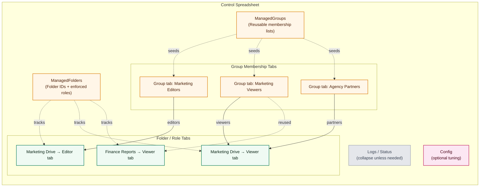

# Google Drive Permission Manager

> **Project status:** Beta — feature complete but still evolving. Expect minor
> breaking changes while we continue to refine the onboarding flow and tooling.

The Google Drive Permission Manager automates Drive folder sharing by treating
one Google Sheet as the source of truth for access. Each folder/role combination
gets its own tab where administrators list email addresses—no scripting
experience required. A bound Apps Script project runs on a five-minute cadence
to keep the relevant Google Groups and Drive permissions aligned with those
tabs. This repository packages that script alongside guided setup
documentation, automated tests, and optional infrastructure helpers so teams can
roll out the workflow consistently.

---

## Table of contents

1. [Key features](#key-features)
2. [Architecture overview](#architecture-overview)
3. [First-time Google Workspace setup](#first-time-google-workspace-setup)
4. [Before you begin](#before-you-begin)
5. [Manual setup with clasp](#manual-setup-with-clasp)
6. [Daily usage](#daily-usage)
7. [Automation & production deployment](#automation--production-deployment)
8. [Documentation map](#documentation-map)
9. [Testing](#testing)
10. [Tearing down the project](#tearing-down-the-project)
11. [Community](#community)

---

## Key features

- **Spreadsheet-first workflow** – Manage Drive access using Google Sheets that
  anyone in the organisation can edit.
- **Google Group indirection** – Each folder/role combination receives its own
  Google Group so Drive never hits the per-folder sharing limit.
- **Safety-first syncs** – Separate menu items for "Sync Adds", "Sync Deletes",
  and "Full Sync" help administrators preview destructive operations.
- **Comprehensive logging** – Operational logs, test logs, and optional email
  notifications make auditing straightforward.
- **Extensive test helpers** – Built-in stress tests and manual access tests are
  available directly from the sheet UI.

---

## Architecture overview

The Apps Script project is split into focused modules (`Core.gs`, `Sync.gs`,
`Audit.gs`, etc.) that orchestrate Drive permissions from a single spreadsheet.
The sheet is the operating manual: administrators describe the folders they care
about, map those folders to Google Groups or direct invitees, and let the
automation enforce whatever is written down. The story below walks through the
control sheet, the sharing relationships, the sync loop, and the personas who
keep everything healthy. A deeper architectural walkthrough is available in
[`gdrive_permissions1.md`](gdrive_permissions1.md).

### 1. Model access in the control sheet

The spreadsheet captures every folder/role pairing and the people (or groups)
who should receive that access. Admins typically maintain a few foundational
tabs:

- **ManagedFolders** — drive IDs, human-friendly names, and which roles should
  be enforced for each folder.
- **ManagedGroups** — optional indirection so one tab can define membership that
  several folder roles reuse.
- **Folder / role tabs** — each tab corresponds to a single folder+role pairing,
  referencing one or more managed groups as well as any direct invitees.
- **Admins + Status** — who may edit the sheet and the timestamps/outcomes of
  recent syncs.
- **Logs / Config** — troubleshooting helpers (these can stay collapsed unless
  something goes wrong).



The diagram shows how a single folder (Marketing Drive) can have both Editor and
Viewer tabs that share a managed group, while another folder (Finance Reports)
reuses different groups entirely. Logs and Config exist, but they sit on the
periphery of day-to-day edits.

### 2. Share folder roles with groups or individuals

Each folder/role definition ultimately shares its access with one or more Google
Groups, plus any optional individual addresses. Those groups get their
membership from the tabs above, so large Drive folders stay within the per-item
sharing limit while still mirroring business org charts. The diagram below shows
how those relationships resolve from definition → group → individual users.


### 3. Let the sync loop do the work

Once the sheet drifts from Drive (because someone added or removed a user), the
five-minute trigger notices the discrepancy and reconciles Workspace to match
the plan. The sequence diagram mirrors the operator experience: edit the sheet,
wait for the automation, watch the status dashboard, and investigate any error
alerts.


### 4. Know who operates what

| Persona / role | What they configure | Day-to-day usage |
| --- | --- | --- |
| **Workspace Super Admin** (a.k.a. Google Workspace Super Administrator) | Creates the Workspace tenant, enables Admin SDK + Drive APIs, authorises the Apps Script project, and grants the automation account least-privilege access. | Periodically reviews audit logs, monitors email alerts, and unblocks escalations that require domain-wide privileges. |
| **Sheet / Automation Admin** | Maintains the control spreadsheet, edits ManagedFolders, ManagedGroups, and Config tabs, and runs the "Sync Adds" / "Sync Deletes" / "Full Sync" menu items. | Updates membership tabs in response to business changes, checks the Status sheet to verify sync recency, and triages any errors surfaced via the Logs or email notifications. |
| **Managed User** (anyone granted access to a folder) | No configuration; they are represented by rows within the relevant group or folder-role tab. | Receives Drive access once the next sync completes, and may use the sheet read-only to confirm which folders they should expect. |

---

## First-time Google Workspace setup

If you are starting from a brand-new Google Workspace tenant, follow the
step-by-step guide in [`docs/WORKSPACE_SETUP.md`](docs/WORKSPACE_SETUP.md). It
walks through:

1. Creating (or reusing) a Workspace tenant and initial Super Admin account.
2. Turning on Google Groups for Business and confirming Super Admin privileges.
3. Creating the control spreadsheet and binding an Apps Script project.
4. Installing this repository with [`clasp`](https://github.com/google/clasp).
5. Enabling the Admin SDK and Drive APIs, granting OAuth consent, and running the
   first sync.

Keep that guide open alongside this README when onboarding new administrators—it
captures every click needed for the initial deployment.

---

## Before you begin

These prerequisites must be in place before you deploy the script:

1. **Google Workspace domain** — personal @gmail accounts cannot access the
   Admin SDK or Drive API required for automation.
2. **Super Admin privileges** — the user performing the setup must be able to
   manage Google Groups and enable Google Cloud APIs.
3. **Registered domain name** — needed for Google Workspace. You can purchase a
   domain during Workspace sign-up if necessary.
4. **Google Cloud billing account** — Apps Script links to a Google Cloud
   project. Enable billing for that project to unlock Admin SDK quota. You can
   create or reuse a billing account from the
   [Cloud Console](https://console.cloud.google.com/billing).

Once these are ready, clone this repository locally and continue with the manual
setup.

---

## Manual setup with clasp

The canonical deployment flow uses [`clasp`](https://github.com/google/clasp) to
push the multi-file Apps Script project to your spreadsheet.

### 1. Install tooling

- Install Node.js 18+ and npm.
- Install clasp globally:
  ```bash
  npm install -g @google/clasp
  ```

### 2. Create the control spreadsheet

1. Create a new Google Sheet named something descriptive (e.g., `Drive
   Permissions Control`).
2. Open **Extensions → Apps Script** to create the bound script project.
3. Copy the **Script ID** from **Project Settings → IDs** — you need it shortly.

### 3. Configure clasp locally

1. Log into clasp:
   ```bash
   clasp login
   ```
2. At the repository root, create `.clasp.json` pointing at the bound project:
   ```json
   {
     "scriptId": "YOUR_SCRIPT_ID",
     "rootDir": "apps_script_project"
   }
   ```
3. Pull the remote manifest so the local project matches the Apps Script
   project:
   ```bash
   clasp pull
   ```

### 4. Push the source files

Deploy all `.gs` and `.js` files to Apps Script:

```bash
clasp push
```

Refreshing the spreadsheet should now reveal a **Permissions Manager** menu.

### 5. Enable required APIs and consent screen

1. In the Apps Script editor, open **Services** and add the following advanced
   services:
   - `AdminDirectory`
   - `Drive` (API v3)
2. From **Project Settings**, follow the link to the attached Google Cloud
   project and ensure the **Admin SDK API** and **Google Drive API** are both
   enabled.
3. Configure the OAuth consent screen if prompted:
   - User type: **Internal** (recommended for Workspace domains)
   - Populate the required contact details and add yourself as a test user.

With APIs enabled, you can return to the sheet and run the initial sync.

---

## Daily usage

1. Refresh the spreadsheet and open **Permissions Manager** from the menu bar.
2. Run **Full Sync (Add & Delete)** for the first execution so all folders,
   groups, and tabs are provisioned.
3. Populate the generated user tabs with email addresses. Removing an email (or
   marking it disabled) followed by **Sync Deletes** revokes access.
4. Review the `Log` sheet after each sync for status messages. Errors contain
   actionable guidance.

For advanced workflows (AutoSync scheduling, edit mode safeguards, or the
risk-based auto sync), consult the guides in the `docs/` directory.

---

## Automation & production deployment

The repository includes optional tooling for larger environments:

- **Docker setup wizard** — see `Dockerfile` and `docker-compose.yml` for a
  containerised helper that validates prerequisites and provisions Google Cloud
  resources.
- **Terraform modules** — the `terraform/` directory automates API enablement,
  service accounts, and quota configuration for production.
- **ProductionOptimizations.gs** — optional Apps Script helpers that reduce API
  calls during large syncs.

These steps are optional but recommended when managing thousands of folders or
when multiple administrators collaborate on the same control sheet.

---

## Documentation map

| Topic | Location |
| ----- | -------- |
| End-user how-to guide | [`docs/USER_GUIDE.md`](docs/USER_GUIDE.md) |
| Hebrew user guide | [`docs/USER_GUIDE_he.md`](docs/USER_GUIDE_he.md) |
| Testing menus and stress scenarios | [`docs/TESTING.md`](docs/TESTING.md) |
| Edit-only mode walkthrough | [`docs/EDIT_MODE_GUIDE.md`](docs/EDIT_MODE_GUIDE.md) |
| Auto-sync options & safety levers | [`docs/AUTO_SYNC_GUIDE.md`](docs/AUTO_SYNC_GUIDE.md) & [`docs/RISK_BASED_AUTO_SYNC.md`](docs/RISK_BASED_AUTO_SYNC.md) |
| Stopping or pausing scripts | [`docs/STOP_SCRIPTS.md`](docs/STOP_SCRIPTS.md) |
| Workspace + script installation walkthrough | [`docs/WORKSPACE_SETUP.md`](docs/WORKSPACE_SETUP.md) |
| Spreadsheet and script onboarding checklist | [`docs/ONBOARDING.md`](docs/ONBOARDING.md) |
| Architecture deep dive | [`gdrive_permissions1.md`](gdrive_permissions1.md) |
| Historical decisions & debugging notes | [`GEMINI.md`](GEMINI.md) |

---

## Testing

Automated Jest tests validate the merge utilities and supporting JavaScript:

```bash
npm ci
npm test -- --runInBand
```

The Apps Script logic is validated through the in-sheet testing harness. After
pushing updates, open the spreadsheet and run **Permissions Manager → Testing →
Run All Tests**. See [`docs/TESTING.md`](docs/TESTING.md) for details and
troubleshooting.

---

## Tearing down the project

To remove the automation:

1. In the spreadsheet, run **Sync Deletes** to revoke any remaining folder
   access.
2. Delete the Google Groups that were created for managed folders.
3. Remove the Apps Script project or delete the bound spreadsheet entirely.
4. If you used the Terraform or Docker workflows, destroy the provisioned Google
   Cloud resources using the respective tooling.

---

## Community

- Review the [Contributing guide](CONTRIBUTING.md) before opening a pull
  request.
- Follow the [Code of Conduct](CODE_OF_CONDUCT.md) to keep the community
  welcoming.
- File issues using the templates under `.github/ISSUE_TEMPLATE/` so we can
  triage efficiently.

Thank you for helping us build a safer way to manage Google Drive permissions!
