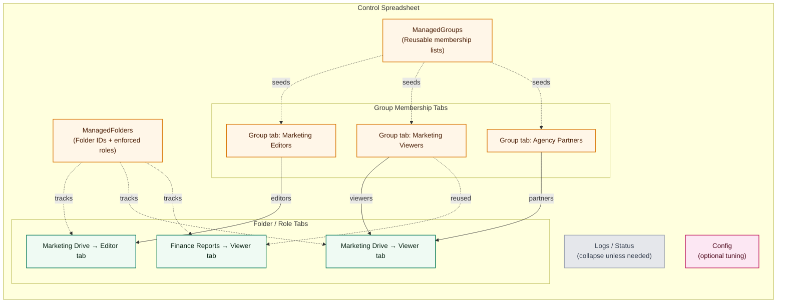
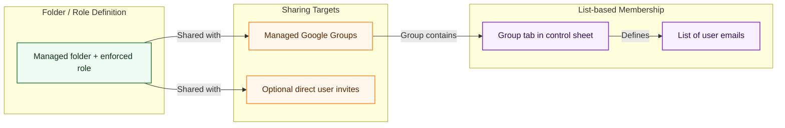
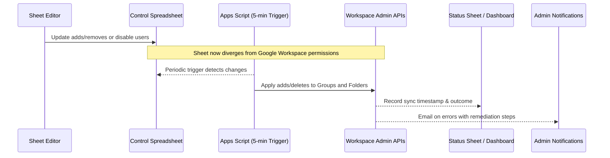

# Project architecture overview

This document summarises the core components that make up the Google Drive
Permission Manager. It complements the high-level description in the README and
is intended for developers or reviewers who need to understand how the pieces
fit together.

## How the pieces fit together

### 1. Model access in the control sheet

The spreadsheet captures every folder/role pairing and the people (or groups)
who should receive that access. Spreadsheet administrators typically maintain a few foundational
tabs:

- **ManagedFolders** — drive IDs, human-friendly names, and which roles should
  be enforced for each folder.
- **ManagedGroups** — optional indirection so one tab can define membership that
  several folder roles reuse.
- **Folder / role tabs** — each tab corresponds to a single folder+role pairing,
  referencing one or more managed groups as well as any direct invitees.
- **SheetEditors_G + Status** — who may edit the control spreadsheet and the timestamps/outcomes of
  recent syncs.
- **Logs / Config** — troubleshooting helpers (these can stay collapsed unless
  something goes wrong).

The diagram shows how a single folder (Marketing Drive) can have both Editor and
Viewer tabs that share a managed group, while another folder (Finance Reports)
reuses different groups entirely. Logs and Config exist, but they sit on the
periphery of day-to-day edits.

### 2. Share folder roles with groups or individuals

Each folder/role definition ultimately shares its access with one or more Google
Groups, plus any optional individual addresses. Those groups get their
membership from the tabs above, so large Drive folders stay within the per-item
sharing limit while still mirroring business org charts. The diagram below shows
how those relationships resolve from definition → group → individual users.

### 3. Let the sync loop do the work

Once the sheet drifts from Drive (because someone added or removed a user), the
five-minute trigger notices the discrepancy and reconciles Workspace to match
the plan. The sequence diagram mirrors the operator experience: edit the sheet,
wait for the automation, watch the status dashboard, and investigate any error
alerts.

### 4. Know who operates what

| Persona / role | What they configure | Day-to-day usage |
| --- | --- | --- |
| **Workspace Super Admin** (a.k.a. Google Workspace Super Administrator) | Creates the Workspace tenant, enables Admin SDK + Drive APIs in Google Cloud Console, authorizes the Apps Script project, and grants necessary API access. This is a Google Workspace system role. | Rarely involved after initial setup. May periodically review audit logs, monitor email alerts, and unblock escalations that require domain-wide API privileges. |
| **Super Admin** (listed in Config > SuperAdminEmails) | Runs sync operations, manages Config settings, runs tests, and troubleshoots errors. Has full menu access in the spreadsheet. This is a script-level permission. | Runs manual sync when needed, monitors SyncHistory and Logs, updates configuration settings, marks items for deletion, and handles escalations. Can also edit sheets. |
| **Sheet Editor** (spreadsheet collaborator with Edit access) | Edits ManagedFolders, UserGroups, and user membership sheets. Marks items for deletion via Delete checkbox. Cannot run scripts or access menu functions. | Updates user lists, adds/removes folders, checks Status column, marks resources for deletion. Changes are applied when a Super Admin runs the next sync. |
| **Managed User** (anyone granted access to a folder) | No configuration; they are represented by rows within the relevant group or folder-role tab. | Receives Drive access once the next sync completes, and may use the sheet read-only to confirm which folders they should expect. |

**Note**: A single person can have multiple roles. For example, in small organizations, the same person may be the Workspace Super Admin, a Super Admin in the script, and a Sheet Editor.

---

## Control spreadsheet structure

The Apps Script solution operates on a purpose-built Google Spreadsheet that acts as
the source of truth for permissions. Important tabs include:

- **ManagedFolders** — defines each folder to manage. Columns specify folder
  names, Drive IDs, target roles (Editor/Viewer/Commenter), default email
  prefixes for Google Groups, and optional settings such as disabled rows.
- **SheetEditors_G** — list of spreadsheet editors. The script keeps this sheet in sync
  with the document's sharing settings so only approved editors can edit
  the control spreadsheet.
- **User group sheets** — automatically generated tabs for each
  folder/role combination plus any reusable groups defined in `UserGroups`. Each
  sheet accepts a list of email addresses and exposes toggles for disabled users
  and optional expiry metadata.
- **UserGroups** — reusable lists of members that can be referenced from
  multiple folders. These entries hydrate dynamic tabs during provisioning.
- **Config** — flags for email notifications, logging verbosity, dry-run mode,
  and experimental automation such as risk-based auto sync.
- **Log** and **TestLog** — append-only audit trails that capture sync outcomes
  and built-in test results respectively.

## Apps Script modules

The Apps Script project lives in the `apps_script_project/` directory and is
split into focused modules:

- **Code.js** — entry point that registers custom menus, defines simple triggers,
  and wires top-level functions to the Google Sheets UI.
- **Core.gs** — orchestration for the primary sync operations, including sheet
  parsing, locking, status updates, and dispatch to helper modules.
- **Sync.gs** — low-level utilities for provisioning Google Groups, applying
  Drive permissions, and reconciling membership differences.
- **Audit.gs** — read-only checks that validate the sheet configuration against
  the current state in Google Workspace.
- **TestHelpers.gs / Tests.gs** — in-sheet testing harness that powers the
  "Manual Access Test", "Stress Test", and other validation routines.
- **Utils.gs, Discovery.gs, Help.gs, EditMode.gs, Setup.gs, Triggers.gs** —
  support files for logging, dynamic menu content, discovery of existing Drive
  assets, edit-mode safeguards, and optional onboarding helpers.
- **ProductionOptimizations.gs** — optional performance enhancements that reduce
  API traffic during large syncs. This file is not required for basic usage but
  can be deployed when scale demands it.
- **ConfigDiagnostic.gs** — diagnostics for the `Config` sheet used during
  troubleshooting.

All modules share constants via `Code.js` and follow the stateless enforcer
model: the spreadsheet contains the desired state, while the script enforces it
without storing additional hidden configuration.

## Execution flow

1. **Menu initialisation** — When the spreadsheet opens, `onOpen()` inserts the
   `Permissions Manager` menu. The Setup module ensures required sheets exist.
2. **Sync invocation** — Administrators choose `Add/Enable Users in Groups`, `Remove/Disable Users from Groups`, or
   `Full Sync`. These menu handlers lock the spreadsheet to avoid concurrent
   edits and then call into `Core.gs`.
3. **Row processing** — `Core.gs` reads `ManagedFolders`, resolves folder IDs via
   `Discovery.gs`, provisions Google Groups using `Sync.gs`, and compares desired
   membership with the Admin SDK.
4. **Permission updates** — Differences are applied through the Drive and Admin
   SDK APIs. The script uses `sendNotificationEmail: false` to prevent redundant
   email noise.
5. **Logging** — Outcomes are written to the `Log` sheet. Errors bubble up with
   contextual hints so administrators can take corrective action.
6. **Testing harness** — When triggered from the testing menu, `Tests.gs`
   executes targeted sync routines defined in `TestHelpers.gs` that operate on
   dedicated test folders without touching production data.

## External dependencies

- **Google Admin SDK** — managing group creation, membership, and metadata.
- **Google Drive API v3** — granting and revoking folder permissions without
  notifying end users.
- **Utilities.sleep / exponential backoff** — rate limiting to respect Google
  API quotas. Production optimisations add caching to further reduce calls.

This modular layout keeps business logic isolated, improves testability, and
allows maintainers to enhance specific behaviour (such as automation or logging)
without editing a monolithic file.

---

## Performance & Scaling Considerations

This project is built on Google Apps Script, a powerful platform that allows for deep integration directly within Google Sheets. This choice provides an "all-in-one" solution where the configuration, controls, and logs all live inside a single, easily managed spreadsheet. However, this convenience comes with performance and scaling characteristics inherent to the Apps Script platform.

### The Apps Script Environment

The entire script runs in a single-threaded, server-side JavaScript environment managed by Google. The most significant platform limitation for large-scale operations is the **maximum script execution time**:

-   **6 minutes** for standard consumer accounts (e.g., `@gmail.com`).
-   **30 minutes** for most Google Workspace accounts.

If a full sync operation takes longer than this limit, it will be terminated.

### Parallelism vs. Batching

True parallelism (i.e., multi-threading) is not a feature of Google Apps Script. While there are advanced workarounds to simulate concurrent execution, they are highly complex and introduce significant risks of data corruption (race conditions) and are therefore not used in this project.

Instead, the script is architected to use the idiomatic and most effective method for performance on this platform: **API Batching**. Rather than making thousands of individual API calls, the script groups many operations (like adding 1000 users to a group, or setting permissions on 100 folders) into single, large batch requests. This offloads the parallel work to Google's highly efficient backend infrastructure. The recent Performance Optimization further enhances this by batching folder-level operations in addition to the already-batched user syncing.

### Expected Limits and Bottlenecks

The script is designed to handle many thousands of individual user permissions across dozens of folders. The ultimate limit is determined by how many API operations can be completed before the execution time limit is reached.

-   The primary bottleneck is the number of **sequential operations** the script must perform.
-   With the batch-oriented optimizations, the number of sequential calls per-folder has been drastically reduced.
-   The main remaining factor is the number of **groups** that need to be synchronized, as each group's membership sync is a distinct batch operation.

As a qualitative guideline: the system performs well for most typical use cases. However, if your configuration involves syncing **several hundred unique folders/groups** in a single run, you may begin to approach the 30-minute execution time limit.

### Alternative for Enterprise-Scale Deployments

For organizations whose needs exceed these platform limits, the logical next step is to re-implement this tool's logic outside of Google Workspace.

-   **Proposed Alternative:** A standalone application, for example a **Python script**, using a Google Cloud Service Account for authentication. This script could be run on a dedicated server, a VM, or within a serverless environment like Google Cloud Functions.
-   **Advantages:**
    -   No practical execution time limits.
    -   Full control over the environment, allowing for true multi-threading and parallel processing.
    -   Access to more extensive libraries and tools.
-   **Disadvantages:**
    -   **Significantly higher complexity.** This approach requires managing a separate application, setting up a Google Cloud project, handling server-side authentication with service accounts and OAuth2, and securing credentials. It is no longer an "all-in-one" worksheet solution.

This project deliberately chose the Apps Script environment to provide a powerful solution with the lowest possible barrier to entry and maintenance, accepting the inherent platform limits in exchange for simplicity and convenience.
