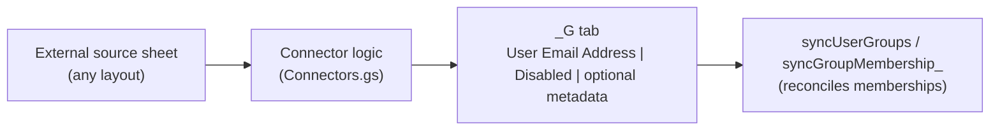
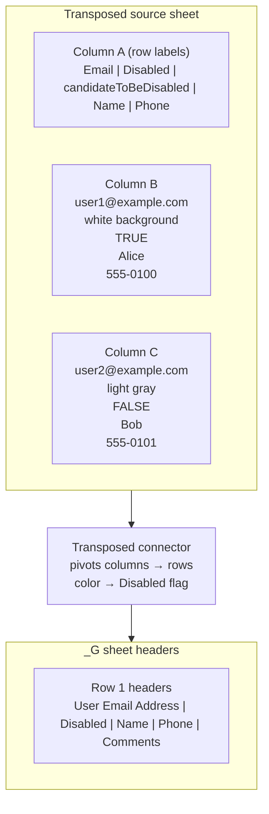
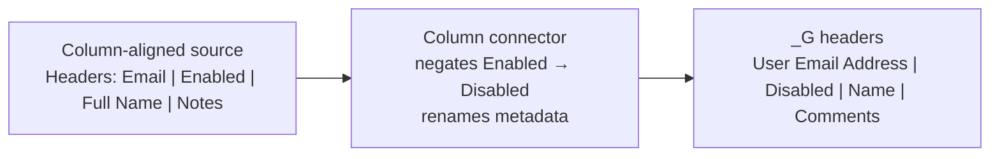
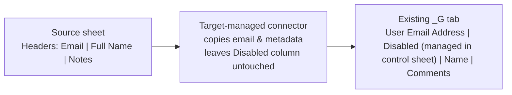

# User Group Connector Guide

The connector layer lets you populate each `<GroupName>_G` sheet from arbitrary
source spreadsheets *before* the built-in `syncGroupMembership_` routine runs.
Each connector normalizes your external data into the standard columns the
sync job expects (`User Email Address` and `Disabled`) and can now append any
number of optional metadata columns (such as `Name`, `Phone`, `Comments`, or
other custom fields).

## How the registry works

`apps_script_project/Connectors.gs` defines three example configurations. Each
entry specifies:

| Field | Purpose |
| ----- | ------- |
| `id` | A short identifier shown in logs. |
| `enabled` | Set to `true` to activate the connector. |
| `groupName` | The `GroupName` from the `UserGroups` sheet that should use the connector. |
| `sourceSpreadsheetId` | ID of the spreadsheet that contains the source data. |
| `sourceSheetName` | Sheet/tab name within that spreadsheet. |
| `additional...` | Optional field mappings that describe any extra columns to copy into the target sheet. |

Depending on the connector type there are extra options (column headers, row
labels, background color hints, etc.). Update the placeholders, flip
`enabled: true`, and the next sync will invoke the connector right before
membership reconciliation.

> **Tip:** You can duplicate the sample objects or add new ones to support
> additional groups. Only the first matching connector runs for a given group.

## Example connectors

### Visual overview

### 1. Transposed sheet with background-color hints

**Config object:** `TRANSPOSED_CONNECTOR_CONFIG`

Use this when each person lives in a column and row labels act as field names
(e.g., column A contains “Email”, “Disabled”, etc.). The connector:

1. Reads the transposed sheet, pivoting one column per user into rows.
2. Ensures a `Disabled` row exists (creates it if missing and seeds boolean
   values derived from the configured color cue).
3. Optionally ensures a helper row (defaults to `candidateToBeDisabled`)
   exists so the source owner can adjust the data manually later.
4. Writes normalized rows into the `_G` sheet with email + disabled status.
5. Optionally copies additional fields (for example `Name`, `Phone`, or
   `Comments`) when you list their row labels under
   `additionalFieldLabels` in the config.

Set `candidateEnabledBackgrounds` to the background color(s) that represent an
*active* user (for example `['#ffffff']` for white). Any other color will mark
the user as disabled on the target sheet.

### 2. Column-aligned sheet with an “Enabled” column

**Config object:** `COLUMN_CONNECTOR_CONFIG`

Point this at any sheet that already lists users line-by-line. Provide the
header names for the email and enabled columns. The connector treats truthy
values (`TRUE`, `Yes`, `1`, `enabled`, etc.) in the configured column as “keep
active” and flips them into the `_G` sheet’s `Disabled` column automatically.
If you also supply `additionalColumns`, each entry (e.g., `{ header: 'Name',
sourceHeader: 'Full Name' }`) is copied into a new column on the `_G` sheet.

### 3. Source without disabled information

**Config object:** `TARGET_DISABLED_CONNECTOR_CONFIG`

When the source only knows about email addresses, this connector copies them
into the `_G` sheet and preserves whatever disabled flags already exist in the
target sheet. That lets an admin manage the `Disabled` checkboxes directly in
the control workbook without losing those changes on the next sync. Optional
`additionalColumns` behave the same as in the column-aligned connector, letting
you sync metadata such as names or notes while keeping the disabled state owned
by the target sheet.

## Adding your own connectors

1. Duplicate one of the sample config objects in `Connectors.gs` or create a
   new one.
2. Implement a new `run...Connector_` helper that reads your source, generates
   rows shaped like `[email, disabled, ...optionalFields]`, and calls
   `writeRowsToTargetSheet_` with the headers you want to maintain.
3. Add the connector to the `USER_GROUP_CONNECTORS` array.
4. Set `enabled: true` and update the mapping fields so the registry can find
   the right group.

Because connectors only touch source sheets via the Apps Script account’s
permissions, the external spreadsheet can live in any shared drive or even in a
different Workspace domain—as long as it is shared with the script user.
