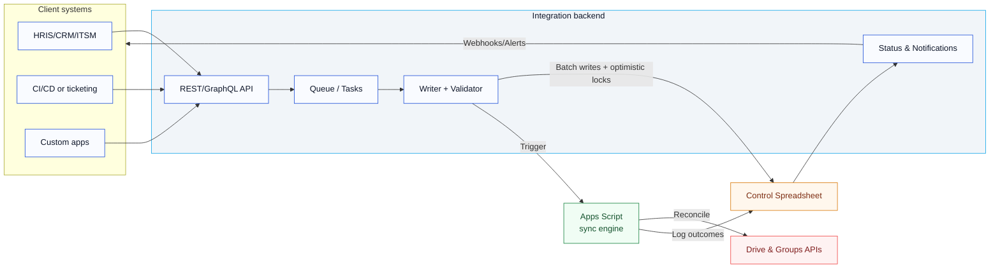

# Integration-friendly backend design

This design note summarizes when and why to add a backend/API for the Google Drive Permission Manager, proposes an integration architecture, and highlights immediate priorities for teams that expect programmatic connectivity.

## Why move beyond direct Sheets access?

Directly reading/writing the control spreadsheet works for small, trusted automations. As integrations grow, a thin backend becomes a high-priority investment because it:
- **Buffers and serializes changes** to avoid Google Sheets and Apps Script quota spikes.
- **Enforces contracts** (folder/role/membership schemas) before mutating Sheets, reducing data-quality regressions.
- **Adds stronger auth/audit** via service-to-service credentials, request signing, and correlation IDs.
- **Enables queueing and retries** so transient errors (throttling, partial writes) do not silently drop updates.
- **Exposes a stable front door** (REST/GraphQL) that decouples callers from spreadsheet column conventions.

## Design goals and non-goals

- **Goals**: predictable syncs under bursty load; clear API contracts; auditable writes; simple rollout path that keeps the spreadsheet UI intact; observable status and errors for operators and integrators.
- **Non-goals**: replacing the spreadsheet UI; implementing complex approval workflows (these can be layered on later once the backend boundary exists).

## High-priority readiness items for integrations

1. **API contract and versioning**: Define resources (`folders`, `roles`, `memberships`) plus a staging flag for writes to “sandbox” tabs. Provide OpenAPI/GraphQL schema and changelog.
2. **Authn/z + audit**: Require service accounts or JWT client credentials; log caller identity and correlation IDs into the `Log`/`Status` tabs (or a backend log sink).
3. **Write serialization and buffering**: Use per-folder/role locks and a queue (e.g., Cloud Tasks, Pub/Sub) to smooth bursts and avoid conflicting writes to the same tab.
4. **Validation guardrails**: Reject malformed payloads early; enforce allowed domains and column/header alignment before touching Sheets.
5. **Operational visibility**: Expose health/status endpoints and webhook/pub-sub notifications that reflect the spreadsheet `Status` tab. Alert on persistent drift or repeated sync failures.
6. **Failure isolation**: Stage writes into temporary tabs, then copy/swap into production tabs only after validation; keep rollback primitives (restore from last known-good snapshot).

## Proposed architecture

### Data flow highlights
- **Ingress**: Clients call the API with folder/role/membership payloads. The API authenticates, validates, and enqueues work items.
- **Write path**: Workers de-duplicate by folder/role, apply optimistic locking (Sheets API ETags), and write into staging tabs before swapping into production tabs.
- **Sync trigger**: After writes, workers invoke the Apps Script Execution API (or web app endpoint) to run `fullSync`/`syncAdds`/`syncDeletes` as needed.
- **Feedback loop**: Status/Log tab updates are surfaced through a status endpoint and optional webhooks/pub-sub notifications.

## Phased rollout plan

1. **Phase 0 – Hardening direct integrations**: Add HMAC validation for any existing Apps Script web app endpoints; enable column/header checks; start logging correlation IDs.
2. **Phase 1 – Thin API gateway**: Stand up a minimal API with auth, schema validation, and enqueueing; continue writing to Sheets directly but serialize per folder/role.
3. **Phase 2 – Queue + staging tabs**: Introduce a queue and staging tabs; implement optimistic locking and rollback on failed validations.
4. **Phase 3 – Observability and hooks**: Publish status endpoints plus webhooks/pub-sub events sourced from the `Status` tab; add dashboards and alerts for drift/lag.
5. **Phase 4 – Deeper backend**: Migrate durable state (e.g., golden membership lists) to a datastore while keeping the spreadsheet as the operator UI; progressively move complex policies out of Apps Script.

## Tech options

- **Hosting**: Cloud Run/Functions, Firebase Hosting + Cloud Functions, or your preferred FaaS/containers platform.
- **Queueing**: Cloud Tasks, Pub/Sub, SQS, or RabbitMQ (if self-hosted).
- **Identity**: Google service accounts with domain-wide delegation for Sheets/Drive; JWT client credentials for external callers; signed HMAC for low-trust webhook sources.
- **Schema validation**: JSON Schema or Zod/Yup in the API; consider rejecting unknown columns and enforcing allowed domains.
- **Monitoring**: Cloud Logging + Error Reporting, paired with spreadsheet log mirroring to BigQuery for retention.

## Open questions to resolve

- What integrations require **strong ordering** versus best-effort eventual consistency?
- Do stakeholders need **approvals** before writes hit production tabs, or is staging + audit logging sufficient?
- Which events should trigger **webhooks** (e.g., sync succeeded, sync failed, drift detected, quota backoff)?
- Are there **data residency** constraints that impact hosting/queuing choices?

Addressing these questions early will help tailor the backend shape and prioritize the next iteration.
