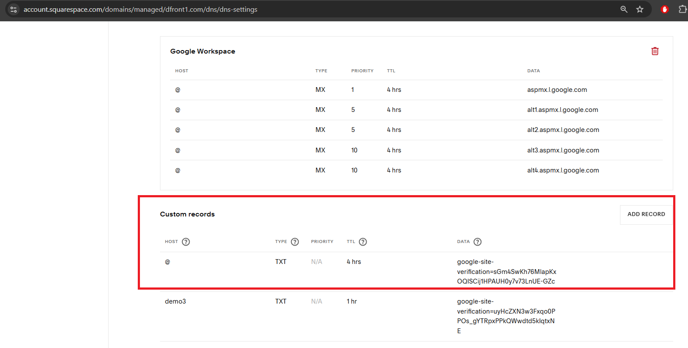
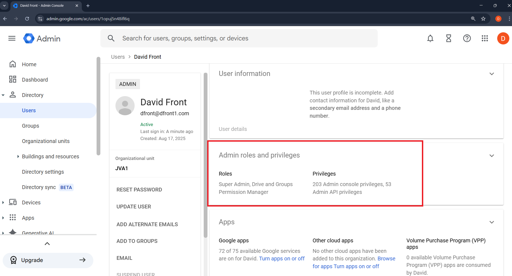
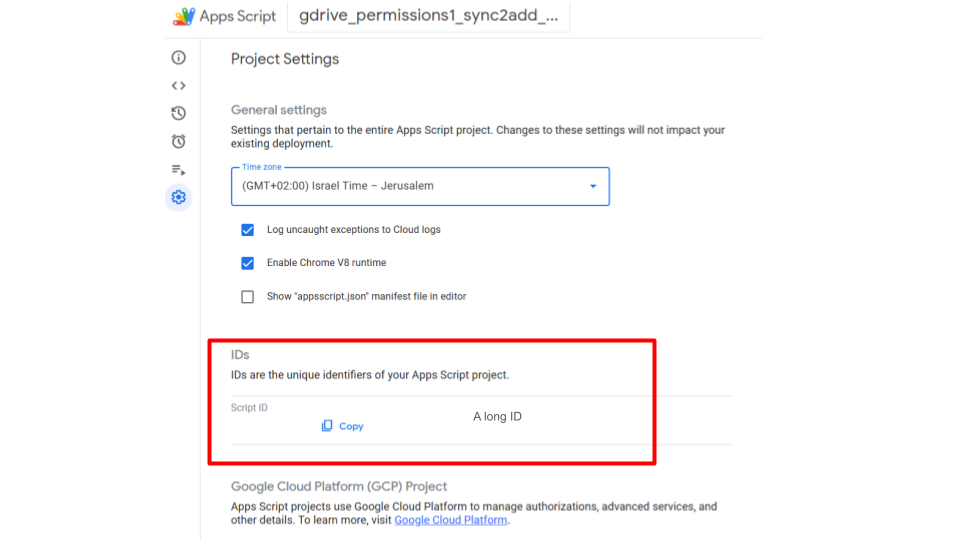
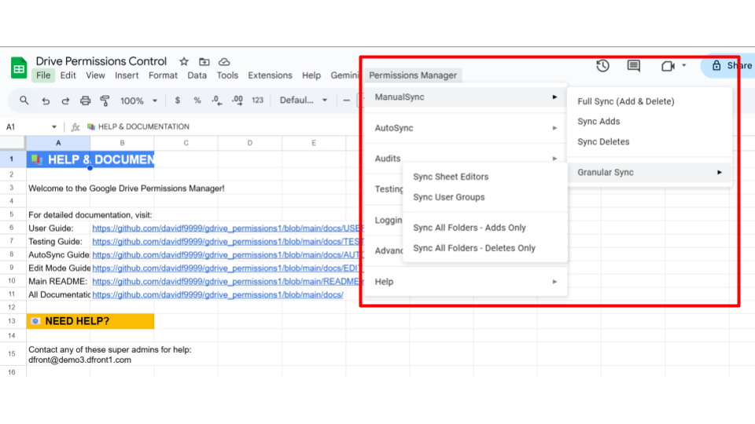
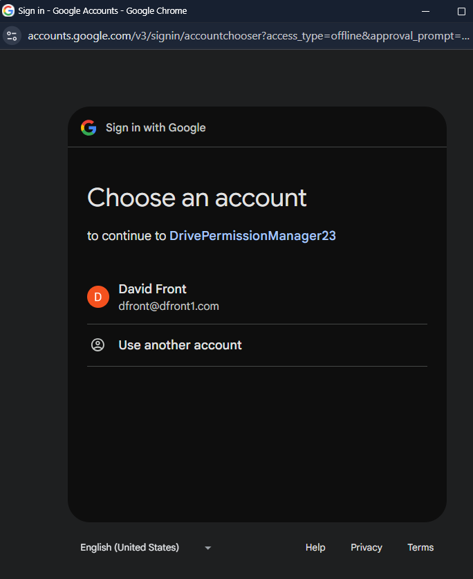

# Google Workspace setup & installation guide

> **Note for AI Assistant Users:** Welcome! You've been directed here from the AI Assistant. This document is the master guide for all setup steps. The [AI Assistant in your terminal](AI_ASSISTANT_GUIDE.md) will automate many of these steps for you. Follow the interactive prompts from the assistant, and use this guide as a reference for the manual steps you'll need to perform in your web browser. The assistant will tell you when you need to refer to this guide.

This document is the comprehensive, step-by-step guide for setting up the Google Drive Permission Manager. It covers every required action, from creating a Google Workspace tenant to deploying the script and running the first sync. For a successful deployment, follow these steps in the presented order.

---

## Setup Steps Overview

-   [Understanding Roles](#understanding-roles)
1.  [Create or reuse a Google Workspace tenant](#1-create-or-reuse-a-google-workspace-tenant)
2.  [Prepare the Super Admin account](#2-prepare-the-super-admin-account)
3.  [Create the control spreadsheet](#3-create-the-control-spreadsheet)
4.  [Authenticate Command-Line Tools](#4-authenticate-command-line-tools)
5.  [Enable APIs and grant consent](#5-enable-apis-and-grant-consent)
6.  [Deploy the Apps Script project](#6-deploy-the-apps-script-project)
7.  [Run the first sync](#7-run-the-first-sync)

---

## Understanding Roles

Before starting the setup, it's important to understand the different roles involved. You will primarily act as the **Installer**, using a **Google Workspace Super Admin** account to perform the privileged actions. We have created a dedicated guide for this.

**➡️ See [Roles and Responsibilities](ROLES_AND_RESPONSIBILITIES.md) for a full breakdown.**


## 1. Create or reuse a Google Workspace tenant

1. Visit [workspace.google.com](https://workspace.google.com/) and start a free
   trial or sign in if your organisation already has a tenant.
2. When prompted for a domain, either:
   - Enter the domain you already own and plan to use for email, **or**
   - Purchase a new domain through Google during the sign-up flow.
3. Complete the sign-up form to create the initial administrator account. Keep
   the username and password handy—you will use this account for the rest of the
   setup.
4. Verify the domain ownership when prompted (usually by adding a TXT record to
   your DNS provider). Follow the official
   [domain verification steps](https://support.google.com/a/answer/183895) and
   use a record similar to:

   | Type | Name/Host | Value |
   | ---- | --------- | ----- |
   | TXT  | @         | google-site-verification=abc123example |

<details>
<summary>Visual aid: Domain verification TXT record</summary>



</details>

> **Tip:** If your organisation already has Workspace, sign into the Admin
> console with an existing Super Admin instead of creating a brand new tenant.

**Common issues at this step:**
- ❌ Domain verification fails → Double-check that the TXT record value matches
  exactly and allow DNS propagation (can take up to an hour).
- ❌ Wrong domain appears in Admin Console → Confirm you started signup with the
  domain you intend to manage.

---

## 2. Prepare the Super Admin account

1. Sign in to [admin.google.com](https://admin.google.com/) using the admin
   account from the previous step.
2. Confirm the account has the **Super Admin** role by visiting
   **Directory → Users → [your user] → Admin roles and privileges**. If the role
   is missing, assign it now.

<details>
<summary>Visual aid: Super Admin role assignment</summary>



</details>

3. Enable the Google Groups service if it is not already active:
   - Navigate to **Apps → Google Workspace → Groups for Business**.
   - Click **On for everyone** and save.
4. **Crucial:** Enable 2-Step Verification (2SV) for the admin account in
   **Security → 2-step verification**. Google Cloud enforces this, and you will be blocked from proceeding without it.
5. Open a new tab to [console.cloud.google.com](https://console.cloud.google.com)
   and accept the Terms of Service so the account can manage Google Cloud
   resources.

> **Why Super Admin?** Admin SDK calls that create and manage Google Groups
> require Super Admin privileges. Delegated roles typically cannot grant the
> scopes needed for the script to function, so perform setup with a Super
> Admin account.

**Common issues at this step:**
- ❌ Groups for Business not available → Ensure the service is enabled for the
  entire organisation, not just an OU subset.
- ❌ Cannot access Cloud Console → Accept the Terms of Service while signed in
  with the Super Admin account and retry.

---

## 3. Create the control spreadsheet

This step must be performed while signed in as the **Google Workspace Super Admin**.

1. While signed in as the Super Admin, go to Google Drive and create a new
   Google Spreadsheet. Give it a descriptive name such as `Drive Permissions Control`.
2. Inside the spreadsheet, open **Extensions → Apps Script** to create a bound Apps
   Script project. Leave the editor open—you will connect the local source files
   shortly.
3. In the Apps Script editor, open **Project Settings → IDs** and take note of the **Script ID** value.

<details>
<summary>Visual aid: Finding the Apps Script ID</summary>



</details>

**Common issues at this step:**
- ❌ Script ID not found → Open **Extensions → Apps Script**, then **Project
  Settings** to reveal the ID.
- ❌ Wrong Google account → Confirm you are signed in with the Super Admin
  before copying the Script ID or running later steps.

---

## 4. Authenticate the Google Cloud CLI (`gcloud`)

> **Note for AI Assistant Users:** The assistant will now handle these command-line steps for you.

This step gives `gcloud` permission to manage resources in your Google Cloud project, like enabling APIs.

1.  **Verify `gcloud` installation.** In your terminal, run `gcloud --version`. If the command is not found, you must install the [Google Cloud SDK](https://cloud.google.com/sdk/docs/install) first. In the recommended Codespaces environment, it should be pre-installed.

2.  **Authenticate `gcloud`.**
    *   In your terminal, run the following command:
        ```bash
        gcloud auth login
        ```
    *   Follow the link to your browser. When prompted, sign in using the **same Google Workspace Super Admin** account you prepared in Step 2.
    *   Return to the terminal after you have successfully logged in.

3.  **Set your GCP Project.** Tell `gcloud` which project you are working on. Replace `YOUR_PROJECT_ID` with your actual Google Cloud Project ID.
    ```bash
    gcloud config set project YOUR_PROJECT_ID
    ```

**Common issues at this step:**
- ❌ `gcloud: command not found` → Ensure the tool is installed and its location is in your system's PATH.
- ❌ `Access blocked` during login → Verify that 2-Step Verification is enabled on your Google Workspace Super Admin account.

---

## 5. Enable APIs and grant consent

The script requires several Google Cloud APIs to be enabled for your GCP project, and the Apps Script API must be enabled for the Super Admin's user account.

1.  **Enable the Project-Level APIs.** In your terminal, run the following `gcloud` commands to enable the required APIs for your project:
    ```bash
    # Enable Admin SDK API (for Google Groups management)
    gcloud services enable admin.googleapis.com --project=YOUR_PROJECT_ID

    # Enable Drive API (for folder permissions)
    gcloud services enable drive.googleapis.com --project=YOUR_PROJECT_ID

    # Enable Apps Script API (for script management)
    gcloud services enable script.googleapis.com --project=YOUR_PROJECT_ID
    ```
    Replace `YOUR_PROJECT_ID` with your actual GCP project ID.

2.  **Enable the User-Level API.** This is a manual step.
    -   Visit **[script.google.com/home/usersettings](https://script.google.com/home/usersettings)**.
    -   Find the setting for "Google Apps Script API" and toggle it **ON**.

    > **Note:** After enabling these APIs, wait 2-5 minutes for the changes to propagate through Google's systems before proceeding.

3.  **Configure the OAuth Consent Screen.** If you have not done so already for this project:
    -   In the [Cloud Console](https://console.cloud.google.com), navigate to **APIs & Services → OAuth consent screen**.
    -   User type: **Internal** (recommended for most Workspace tenants).
    -   App name: something descriptive such as `Drive Permission Manager`.
    -   Add the Super Admin account as a test user, then save and publish.

**Common issues at this step:**
- ❌ API errors during a later step → Verify you enabled all three APIs in the Cloud Console (`gcloud` commands) **and** the Apps Script user settings page.
- ❌ `"The Admin SDK API is not enabled for GCP project..."` error when running tests → Run `gcloud services enable admin.googleapis.com --project=YOUR_PROJECT_ID` and wait 2-5 minutes.
- ❌ APIs not propagating → Wait a full 5 minutes after enabling before testing. API enablement is not instant.

---

## 6. Deploy the Apps Script project

Now you will deploy the code from this repository into the Apps Script project you created. This is a manual copy-and-paste process.

1.  **Install project dependencies.** In your local terminal, at the root of the repository, run `npm install`. This is only needed once.
    ```bash
    npm install
    ```
2.  **Build the script bundle.** Run the build script to combine all the separate source code files into a single bundle for deployment.
    ```bash
    node create_apps_scripts_bundle.js
    ```
    This will create a new file at `dist/apps_scripts_bundle.gs`.

3.  **Copy the bundled code.** Open the `dist/apps_scripts_bundle.gs` file in a text editor, select all the text, and copy it to your clipboard.

4.  **Paste into the Apps Script Editor.**
    *   Return to the Apps Script editor you opened in Step 3.
    *   If there is any existing code in the `Code.gs` file, delete it completely.
    *   Paste the code from your clipboard into the `Code.gs` editor window.
    *   Click the **Save project** icon (a floppy disk) at the top of the editor.

5.  **Configure Project Settings.**
    *   In the Apps Script editor, open **Project Settings** (gear icon in the left sidebar).
    *   Scroll to **General settings** and set the timezone to your preferred timezone (e.g., `America/New_York`, `Europe/London`, `Etc/UTC`). The default timezone in the repository is UTC, but you should change it to match your organization's timezone.
    *   Scroll to **Google Cloud Platform (GCP) Project** and enter your GCP Project ID (you can find this in the Google Cloud Console).

6.  **Create the config.json file.**
    *   In the Apps Script editor, click the **+** button next to **Files** in the left sidebar.
    *   Select **Script** and name it `config.json`.
    *   Open the `apps_script_project/config.json.template` file from this repository in a text editor.
    *   Copy its contents and paste into the `config.json` file you just created.
    *   Replace `YOUR-GCP-PROJECT-ID` with your actual GCP Project ID.
    *   Replace `YOUR-GOOGLE-SHEET-ID` with the ID of your control spreadsheet (you can find this in the spreadsheet URL: `https://docs.google.com/spreadsheets/d/YOUR-GOOGLE-SHEET-ID/edit`).
    *   Save the file.

7.  Return to your control spreadsheet and refresh the page. The **Permissions Manager** menu will appear once the script is saved.

<details>
<summary>Visual aid: Permissions Manager menu</summary>



</details>

**Common issues at this step:**
- ❌ `ReferenceError: "some_function" is not defined.` → This usually means the copy-paste was incomplete or the `node create_apps_scripts_bundle.js` script failed. Ensure the entire contents of `dist/apps_scripts_bundle.gs` are in the editor.
- ❌ `Permissions Manager` menu does not appear → Refresh the spreadsheet. Make sure you saved the project in the Apps Script editor. Double check for any error messages at the top of the editor.
- ❌ Timezone issues or dates appear incorrect → Verify you set the correct timezone in Project Settings (step 5).
- ❌ `config.json` not found errors → Ensure you created the `config.json` file in the Apps Script editor with your GCP Project ID and Sheet ID (step 6).

---

## 7. Run the first sync

1. Back in the spreadsheet, open **Permissions Manager → ManualSync → Full Sync**.
2. Grant the script permissions when asked—the prompts will appear twice: once
   for Admin SDK access and once for Drive access.

<details>
<summary>Visual aid: Authorization prompt</summary>



</details>

3. After the sync completes, review the generated sheets and populate the user
   tabs with email addresses.
4. Use **Add/Enable Users in Groups** and **Remove/Disable Users from Groups** (under the ManualSync menu) for day-to-day changes. The
   [`docs/USER_GUIDE.md`](docs/USER_GUIDE.md) file explains the workflow in
   detail.

You now have a fully configured Google Workspace administrator account and a
working installation of the Google Drive Permission Manager. Keep the Super
Admin credentials secure and add additional administrators through the `SheetEditors`
sheet rather than sharing the Super Admin password directly.

---

## Optional onboarding aids

- **Screen recording walkthrough:** Record a short (5–10 minute) video that
  demonstrates the exact clicks in this guide. Tools like Loom, Screencastify,
  or Google Meet recordings are sufficient—you do not need professional editing
  to be helpful.
- **Slide deck or checklist PDF:** Export this guide or the
  [`ONBOARDING.md`](ONBOARDING.md) checklist to share with colleagues who
  prefer printable references.
- **Live demo session:** Host a short call where you follow this guide in real
  time and let other admins ask questions.

Any of these aids can significantly reduce onboarding time for new team members
once you have the written steps in place.