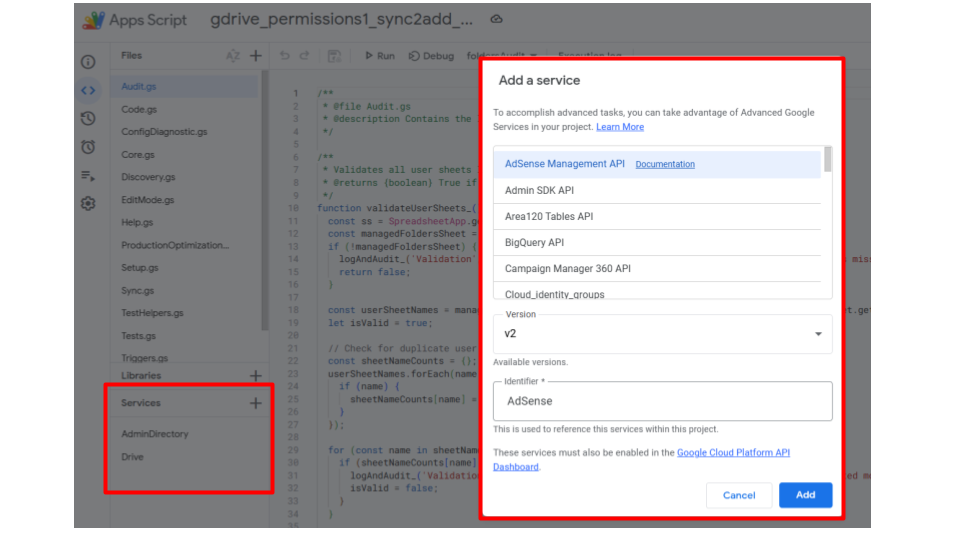

# Google Workspace setup & installation guide

This walkthrough expands on the quick checklist in the [README](../README.md#-stop-prerequisites) so
first-time administrators can stand up a Google Workspace tenant, create the
required Super Admin user, and deploy the Google Drive Permission Manager from a
fresh spreadsheet. Each step is short and sequential—follow them in order the
first time you roll out the tool.

---

## 1. Create or reuse a Google Workspace tenant

1. Visit [workspace.google.com](https://workspace.google.com/) and start a free
   trial or sign in if your organisation already has a tenant.
2. When prompted for a domain, either:
   - Enter the domain you already own and plan to use for email, **or**
   - Purchase a new domain through Google during the sign-up flow.
3. Complete the sign-up form to create the initial administrator account. Keep
   the username and password handy—you will use this account for the rest of the
   setup.
4. Verify the domain ownership when prompted (usually by adding a TXT record to
   your DNS provider). Follow the official
   [domain verification steps](https://support.google.com/a/answer/183895) and
   use a record similar to:

   | Type | Name/Host | Value |
   | ---- | --------- | ----- |
   | TXT  | @         | google-site-verification=abc123example |

<details>
<summary>Visual aid: Domain verification TXT record</summary>


</details>

> **Tip:** If your organisation already has Workspace, sign into the Admin
> console with an existing Super Admin instead of creating a brand new tenant.

**Common issues at this step:**
- ❌ Domain verification fails → Double-check that the TXT record value matches
  exactly and allow DNS propagation (can take up to an hour).
- ❌ Wrong domain appears in Admin Console → Confirm you started signup with the
  domain you intend to manage.

---

## 2. Prepare the Super Admin account

1. Sign in to [admin.google.com](https://admin.google.com/) using the admin
   account from the previous step.
2. Confirm the account has the **Super Admin** role by visiting
   **Directory → Users → [your user] → Admin roles and privileges**. If the role
   is missing, assign it now.

<details>
<summary>Visual aid: Super Admin role assignment</summary>


</details>

3. Enable the Google Groups service if it is not already active:
   - Navigate to **Apps → Google Workspace → Groups for Business**.
   - Click **On for everyone** and save.
4. Optional but recommended: enable 2-Step Verification for the admin account in
   **Security → 2-step verification** to protect API access.
5. Open a new tab to [console.cloud.google.com](https://console.cloud.google.com)
   and accept the Terms of Service so the account can manage Google Cloud
   resources.

> **Why Super Admin?** Admin SDK calls that create and manage Google Groups
> require Super Admin privileges. Delegated roles typically cannot grant the
> scopes needed for the script to function, so perform setup with a Super
> Admin account.

**Common issues at this step:**
- ❌ Groups for Business not available → Ensure the service is enabled for the
  entire organisation, not just an OU subset.
- ❌ Cannot access Cloud Console → Accept the Terms of Service while signed in
  with the Super Admin account and retry.

---

## 3. Create the control spreadsheet

1. While signed in as the Super Admin, go to Google Drive and create a new
   Google Spreadsheet. Give it a descriptive name such as `Drive Permissions Control`.
2. Inside the spreadsheet, open **Extensions → Apps Script** to create a bound Apps
   Script project. Leave the editor open—you will connect the local source files
   shortly.
3. In the Apps Script editor, open **Project Settings → IDs** and copy the
   **Script ID** value. You will paste it into `.clasp.json` when configuring the
   CLI.

<details>
<summary>Visual aid: Finding the Apps Script ID</summary>


</details>

**Common issues at this step:**
- ❌ Script ID not found → Open **Extensions → Apps Script**, then **Project
  Settings** to reveal the ID.
- ❌ Wrong Google account → Confirm you are signed in with the Super Admin
  before copying the Script ID or running later steps.

---

## 4. Install the Apps Script project with clasp

> **Note for AI Assistant Users:** If you are using the AI Assistant in a GitHub Codespace, the environment is already prepared for you. The repository is cloned, and `clasp` is pre-installed. The assistant will guide you through creating the `.clasp.json` file.

The following steps are for users performing a manual setup on their local machine.

1. On your local machine, install the required tools:
   ```bash
   # Install clasp globally if you haven't already
   npm install -g @google/clasp
   ```
2. Clone this repository and change into the project directory:
   ```bash
   git clone https://github.com/<your-org>/gdrive-permission-manager.git
   cd gdrive-permission-manager
   ```
3. Create `.clasp.json` in the repository root pointing at the bound Apps Script
   project:
   ```json
   {
     "scriptId": "YOUR_SCRIPT_ID",
     "rootDir": "apps_script_project"
   }
   ```
4. Authenticate clasp with the same Super Admin account:
   ```bash
   clasp login
   ```
5. Push the repository sources into Apps Script:
   ```bash
   clasp push
   ```
6. Return to the spreadsheet and refresh. The **Permissions Manager** menu will
   appear once the push completes.

<details>
<summary>Visual aid: Permissions Manager menu</summary>


</details>

**Common issues at this step:**
- ❌ `clasp: command not found` → Run `npm install -g @google/clasp`.
- ❌ `Unauthorized` when `clasp push` → Ensure you ran `clasp login` with the
  Super Admin account before pushing.
- ❌ `Script ID not found` → Double-check `.clasp.json` points to the Script ID
  from the bound Apps Script project.

---

## 5. Enable APIs and grant consent

1. In the Apps Script editor, click the **+** button next to **Services** and add
   the following advanced services:
   - **AdminDirectory API**
   - **Drive API (v3)**

<details>
<summary>Visual aid: Enabling advanced services</summary>



</details>

2. From **Project Settings**, open the associated Google Cloud project in a new
   tab.
3. In the Cloud Console, enable these APIs if they are not already active:
   - **Admin SDK API**
   - **Google Drive API**
4. Configure the OAuth consent screen when prompted:
   - User type: **Internal** (recommended for most Workspace tenants)
   - App name: something descriptive such as `Drive Permission Manager`
   - Add the Super Admin account as a test user
   - Save and publish

| Apps Script Services | Cloud Console APIs |
| -------------------- | ------------------ |
| Enable **AdminDirectory API** and **Drive API (v3)** under **Services** in the Apps Script editor. | Enable **Admin SDK API** and **Google Drive API** in the linked Google Cloud project. |

> **Why these scopes?** Admin SDK permissions let the script create and manage
> Google Groups, while Drive scopes allow folder sharing updates. Both are
> required for the sync loop to align Drive with the spreadsheet.

**Common issues at this step:**
- ❌ Cannot add advanced services → Make sure you are using the bound script
  project created earlier and are logged in as Super Admin.
- ❌ Consent screen shows unfamiliar scopes → The Admin SDK and Drive scopes are
  necessary for creating groups and updating folder permissions on behalf of the
  domain. Scopes are limited to your tenant.
- ❌ APIs still appear disabled → Verify you enabled them both in Apps Script
  **and** the Cloud Console.

---

## 6. Run the first sync

1. Back in the spreadsheet, open **Permissions Manager → ManualSync → Full Sync**.
2. Grant the script permissions when asked—the prompts will appear twice: once
   for Admin SDK access and once for Drive access.

<details>
<summary>Visual aid: Authorization prompt</summary>


</details>

3. After the sync completes, review the generated sheets and populate the user
   tabs with email addresses.
4. Use **Add Users to Groups** and **Remove Users from Groups** (under the ManualSync menu) for day-to-day changes. The
   [`docs/USER_GUIDE.md`](docs/USER_GUIDE.md) file explains the workflow in
   detail.

You now have a fully configured Google Workspace administrator account and a
working installation of the Google Drive Permission Manager. Keep the Super
Admin credentials secure and add additional administrators through the `SheetEditors`
sheet rather than sharing the Super Admin password directly.

---

## Optional onboarding aids

- **Screen recording walkthrough:** Record a short (5–10 minute) video that
  demonstrates the exact clicks in this guide. Tools like Loom, Screencastify,
  or Google Meet recordings are sufficient—you do not need professional editing
  to be helpful.
- **Slide deck or checklist PDF:** Export this guide or the
  [`ONBOARDING.md`](ONBOARDING.md) checklist to share with colleagues who
  prefer printable references.
- **Live demo session:** Host a short call where you follow this guide in real
  time and let other admins ask questions.

Any of these aids can significantly reduce onboarding time for new team members
once you have the written steps in place.